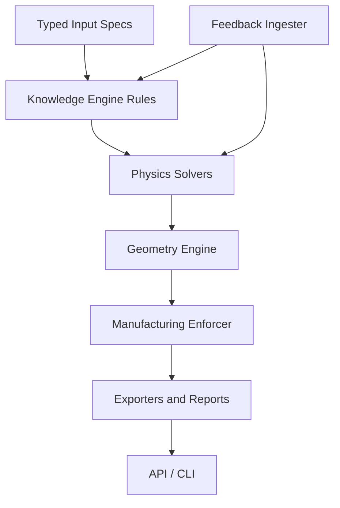

# NOVA Architecture

NOVA is organized as a modular Python monorepo:

## Deterministic Pipeline

1. Validate engineering requirements with Pydantic models and physical-unit metadata.
2. Run analytical physics solvers for combustion, nozzle flow, heat transfer, structure, EM, and heat exchangers.
3. Convert physics results into traceable geometry parameters.
4. Generate mesh-backed solids and channel paths.
5. Enforce process-specific manufacturability constraints before export.
6. Export STL, STEP handoff, OBJ, 3MF, JSON data, and PDF reports.
7. Store test/manufacturing feedback for later empirical coefficient updates.

## Current Build Scope

The first implementation prioritizes the specified starting point: input schemas,
rocket combustion/nozzle/cooling/structure solvers, mesh geometry primitives,
NOVA-RP end-to-end design, tests, API, CLI, and documentation. Optional CAD
kernels can replace the mesh fallback without changing public module APIs.

